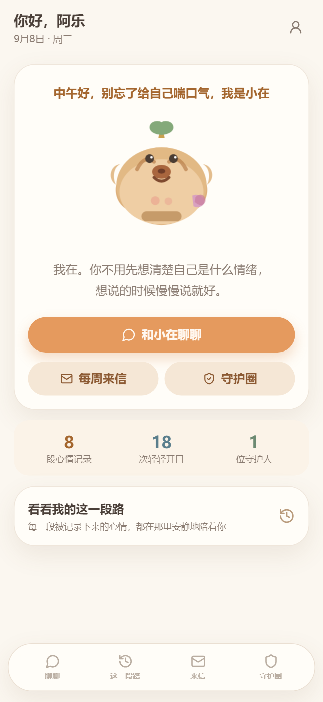

# 有我在 APP MVP V1.0

「有我在」是一款以卡皮巴拉 AI 伙伴“小在”为核心 IP 的陪伴型情绪记录 App。它帮助用户更容易表达情绪、形成可回顾的记录、理解长期变化，并在用户事前明确授权的前提下，在高风险场景中连接现实社会支持网络“守护圈”。

本项目是 AI Solution 岗位作品集 / 可运行 MVP Demo。

**线上公开 Demo：** https://youwozai-demo.jdfhd1688.chatgpt.site

> 线上版本使用独立的模拟数据环境，仅供产品体验，请勿输入真实隐私信息。



[查看 6 张脱敏产品截图](./portfolio/screenshots) · [观看 88 秒演示视频](./portfolio/有我在APP演示视频.webm)

## 项目资料

- [作品集一页说明](./PORTFOLIO.md)
- [PRD、Spec、架构、安全、测试与 SDD 文档](./docs/README.md)
- [标准演示手册](./docs/DEMO.md)
- [作品集交付清单](./docs/PORTFOLIO_CHECKLIST.md)

## 技术栈

- Next.js 15 + React 19 + TypeScript
- SQLite（Node 内置 `node:sqlite`，无需原生编译）
- Cookie Session 本地认证
- 服务端业务逻辑与本地确定性 AI 引擎
- 统一 LLM Provider：陪伴回复与情绪结构化抽取接入 OpenAI-compatible API；无 Key 自动降级到本地规则引擎
- 统一 TTS Provider：小在语音优先、文字同步；无 Key 或 API 失败时降级到浏览器 Web Speech

## 本地运行步骤

建议使用 Node 22.5+。项目当前使用 pnpm：

```bash
pnpm install
pnpm db:seed
pnpm test
pnpm dev
```

打开 [http://localhost:3000](http://localhost:3000)

如果使用 npm：

```bash
npm install
npm run db:seed
npm test
npm run dev
```

## 环境变量说明

复制 `.env.example` 为 `.env.local` 后按需修改。

```bash
PORT=3000
DATABASE_PATH=data/youwozai.db
NEXT_PUBLIC_APP_URL=http://localhost:3000

# 可选，未配置时使用离线规则引擎，保证本地 Demo 可运行
OPENAI_API_KEY=your_api_key_here
OPENAI_BASE_URL=https://api.openai.com/v1
OPENAI_MODEL=gpt-4o-mini

# 统一 LLM Provider
LLM_API_KEY=your_api_key_here
LLM_BASE_URL=https://api.openai.com/v1
LLM_MODEL=gpt-4o-mini

# OpenAI TTS 主链路；未配置 Key 时才降级到浏览器 Web Speech
TTS_API_KEY=your_api_key_here
TTS_BASE_URL=https://api.openai.com/v1
TTS_MODEL=gpt-4o-mini-tts
TTS_VOICE=coral
TTS_SAFETY_VOICE=sage

DEMO_EMAIL=demo@youwozai.app
DEMO_PASSWORD=Capybara123
```

## 已实现功能

- 邮箱 + 密码注册登录、退出登录、账号注销
- 首页小在主视觉、随机开场白与主要入口
- “和小在聊聊”陪伴式对话
- 小在角色语音：文字同步、播放/暂停/继续、自动播放设置与语速设置
- AI 结构化情绪抽取、确认卡片、用户修改/保存
- 心情历史记录查看、编辑、删除
- “有我在·每周来信”、趋势图、情绪分布、成长相册
- 守护圈：添加守护人、关系维护、逐人授权矩阵
- 高风险 Safety Workflow 与紧急/专业支持指引
- High Risk 三层体验：短句安抚、三个主操作、折叠求助详情
- 站内模拟守护通知、撤销、发送状态与审计记录
- 隐私与 AI 记忆管理
- 最近 7 天 / 30 天数据聚合

## 未实现功能

- 真实短信 / 微信 / 第三方 IM 通知
- APP 内实时语音 / 视频通话
- 自动电话外呼
- 实时面部情绪识别
- 情绪互动社区、陌生人随机语音匹配
- 专家问答 / 咨询师商城、完整心理测评题库
- 情绪小游戏与排行榜
- 冥想 / 有声内容平台
- 壁纸 / 皮肤商城
- 线下活动推荐
- 月度 / 季度长期来信

## Demo 测试流程

1. 使用测试账号登录
2. 进入“和小在聊聊”，从三条低/中/高风险示例中选择一条发送
3. 保存结构化情绪记录
4. 查看“心情”历史、“每周来信”与成长相册
5. 进入“守护圈”添加守护人并逐项配置授权
6. 高风险记录触发待确认通知，模拟发送或撤销，查看审计记录
7. 在“隐私中心”修改资料、管理 AI 记忆或退出/注销

## 测试账号

| 角色 | 邮箱 | 密码 |
| --- | --- | --- |
| 用户 | demo@youwozai.app | Capybara123 |
| 守护人 | guardian@youwozai.app | Guardian123 |

## Low / Medium / High 风险测试场景

在“和小在聊聊”输入以下文本即可验证不同路径：

- **Low**：`今天同事把方案改了却没告诉我，我做了三天的东西突然白费了，很委屈又很烦。`
- **Medium**：`这半个月我总觉得自己被掏空了，晚上也睡不好，白天不想见任何人，感觉没有希望。`
- **High**：`最近我总是想，要是能消失就好了，早上也不想醒来，觉得这样下去真的没有意义。` 系统会进入固定 Safety Workflow，同时生成 `riskLevel="high"` 的记录确认卡；保存后可按照守护圈授权生成待确认通知。

## 当前已知问题

- 语音输入目前仅为界面入口，没有接入真实语音转文字能力。
- 当前默认无真实 LLM / TTS Key，展示时使用本地规则引擎与浏览器语音合成 fallback。
- 配置 TTS Key 后，小在使用 `gpt-4o-mini-tts`：日常语音为 `coral`，High Risk 为更慢、更克制的 `sage`。浏览器首次需要通过发送消息或点击播放解锁音频；同一页面会话内才会按设置自动播放。
- 守护通知为站内模拟，不是真实短信 / Push。
- 当前版本已在 Windows 环境完成 `pnpm test` 与 `pnpm build`。
- LLM 接口已预留但当前默认未配置，风险分级与结构化抽取由离线规则引擎完成。
